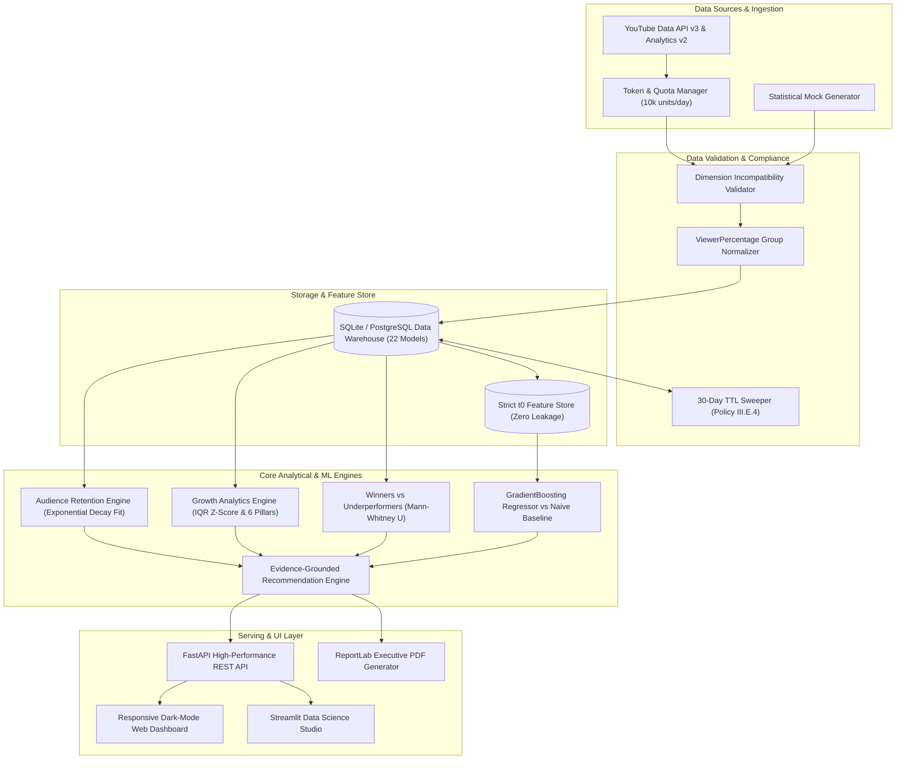

# System Architecture & Technical Specification

## YouTube Channel Growth Analysis and Intelligence Platform

### 1. High-Level Architectural Overview

The YouTube Channel Growth Analysis Platform is designed as an end-to-end data intelligence and predictive analytics platform. It bridges raw API extraction, statistical validation, non-linear audience retention modeling, leakage-free machine learning, and evidence-grounded recommendation engines.

---

### 2. Database Schema (22 Relational Models)

The data model uses 22 tables with complete foreign key integrity, temporal indices, and compliance timestamps:
- **Core Entities:** `User`, `OAuthConnection`, `Channel`, `Video`, `ContentCategory`
- **Raw Telemetry (30-day TTL):** `VideoStatistics`, `VideoDailyAnalytics`, `ChannelDailyAnalytics`, `AudienceAnalytics`, `AudienceRetention`, `TrafficSources`, `Demographics`, `DeviceAnalytics`
- **Derived Analytics (Permanent Storage):** `DerivedVideoMetrics`, `DerivedContentCluster`
- **Machine Learning & Feature Store:** `FeatureStore`, `MLPrediction`, `ModelRun`
- **Actionable Intelligence:** `Recommendation`, `NextVideoOpportunity`, `ABExperiment`
- **Operational & Governance:** `DataIngestionRun`, `DataQualityReport`, `GeneratedReport`, `ComplianceLog`, `QuotaLedger`

---

### 3. Key Mathematical Models & Formulations

#### 3.1. Robust Virality Z-Score
YouTube view distributions are heavily skewed (power-law distribution). Mean and standard deviation are susceptible to extreme viral outliers. We utilize median and Interquartile Range ($IQR$):
$$Z_{\text{robust}} = \frac{x_i - \text{Median}(X)}{\text{IQR}(X) \times 0.7413}$$
where $\text{IQR} = Q_3 - Q_1$, and $0.7413$ scales the $IQR$ to an asymptotically unbiased estimator of standard deviation under normality.

#### 3.2. Exponential Audience Retention Decay
Retention decay over elapsed video ratio $t \in [0, 1]$ is modeled using non-linear least squares (`scipy.optimize.curve_fit`):
$$R(t) = R_0 \cdot e^{-\lambda t} + C$$
- $R_0$: Initial Hook Retention Amplitude
- $\lambda$: Decay rate parameter
- $C$: Baseline loyal core audience plateau
- **Model Gating:** Any video fit with $R^2 < 0.70$ is flagged for anomalous viewer behavior (e.g., massive internal chapter skipping).

#### 3.3. Recommendation Priority Formula
$$\text{Priority Score} = \text{Impact} \times \text{Confidence} \times \text{Opportunity} \times \text{Feasibility}$$
Where:
- $\text{Impact} \in [1, 10]$: Expected percentage uplift on core KPI
- $\text{Confidence} \in [0.1, 1.0]$: Derived from sample size $n$ and statistical significance ($p < 0.05$)
- $\text{Opportunity} \in [1, 10]$: Gap between current channel metric and top quartile benchmark
- $\text{Feasibility} \in [1, 10]$: Ease of operational execution by creator
